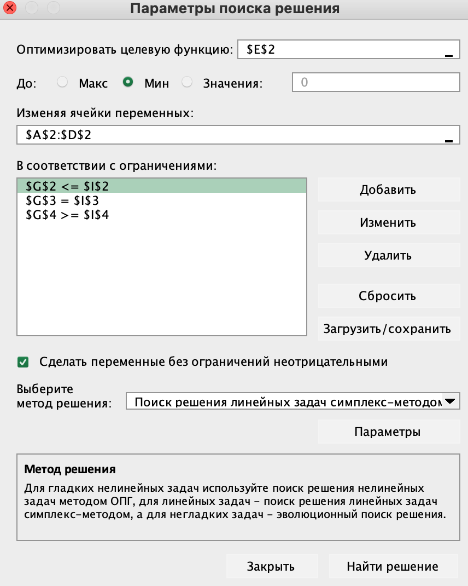
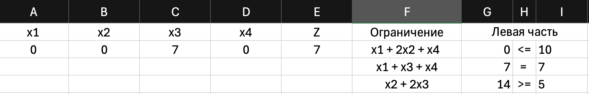

# Задание №1. Разработка программного обеспечения для решения задачи линейного программирования

**Ф.И.О.:** Филиппов Владимир Леонидович    
**Поток:** МетОпт 1.2  
**Вариант:** 6

## 1. Задача

Найти минимум целевой функции:

**Z = 2x1 + x2 + x3 + 3x4 → min**

при ограничениях:

1) x1 + 2x2 + x4 ≤ 10  
2) x1 + x3 + x4 = 7  
3) x2 + 2x3 ≥ 5  

## 2. Реализация (полный цикл по заданию)

Программа в ноутбуке выполняет полный цикл решения ЗЛП:

1) **Считывание текстового файла** с постановкой задачи (`input.txt`).  
2) **Приведение к каноническому виду** (система равенств + неотрицательность) путём добавления:
   - добавочных переменных (slack) для ограничений `<=`
   - избыточных переменных (surplus) и искусственных (artificial) для `>=`
   - искусственных (artificial) для `=`
3) **Формирование вспомогательной задачи (фаза 1)**:  
   W = сумма искусственных переменных → min
4) **Решение фазы 1 симплекс-методом**:
   - если W_min > 0 → исходная система ограничений несовместна (решений нет)
5) **Переход к основной задаче (фаза 2)**:  
   минимизация исходной целевой функции Z при найденном допустимом базисе
6) **Решение фазы 2 симплекс-методом**
7) **Вывод ответа**: оптимальная точка x* и значение Z_min  
   или сообщение: infeasible / unbounded (с причиной)

## 3. Краткий алгоритм (псевдокод)

**Вход:** sense, c, ограничения (A, знак, b)  
**Выход:** x*, Z(x*) или причина отсутствия решения

```
прочитать (sense, c, A, signs, b) из TXT

(Aeq, beq, c1, c2, basis) = привести_к_каноническому_виду(A, b, signs, c)

# Фаза 1:
решить min W = c1^T x  при Aeq x = beq, x>=0  симплексом
если W_min > 0:
    вывести "несовместна (infeasible)" и остановиться

# Фаза 2:
решить min Z = c2^T x  при Aeq x = beq, x>=0  симплексом
если unbounded:
    вывести "не ограничена (unbounded)" и остановиться

вывести x* (только x1..x4) и Z_min
```

## 4. Формат входного файла

Файл `input.txt` содержит только данные:

- 1-я строка: `min` или `max`
- 2-я строка: коэффициенты цели (через пробел)
- далее: ограничения построчно в виде  
  `a1 a2 a3 a4 <= b` (или `>=`, или `=`)

Пример (наш вариант):

```
min
2 1 1 3
1 2 0 1 <= 10
1 0 1 1 = 7
0 1 2 0 >= 5
```

## 5. Как запустить

1) Откройте файл ноутбука `lab1.ipynb`.  
2) Убедитесь, что рядом лежит `input.txt`.  
3) Выполните ячейки сверху вниз.

## 6. Демонстрация работы (что должно получиться)

Ожидаемый результат:

- x1 = 0  
- x2 = 0  
- x3 = 7  
- x4 = 0  
- Z_min = 7

## 7. Сравнение с MS Excel («Поиск решения»)



## 8. Вывод

В ходе работы стало понятно, как из общей постановки ЗЛП получить канонический вид и почему ограничения `=` и `>=` требуют искусственных переменных для построения стартового базиса. Основная трудность - аккуратно реализовать два этапа: фазу 1 (поиск допустимого решения) и фазу 2 (поиск оптимума). После реализации стало проще понимать работу симплекс-таблицы и выбор ведущих элементов.
