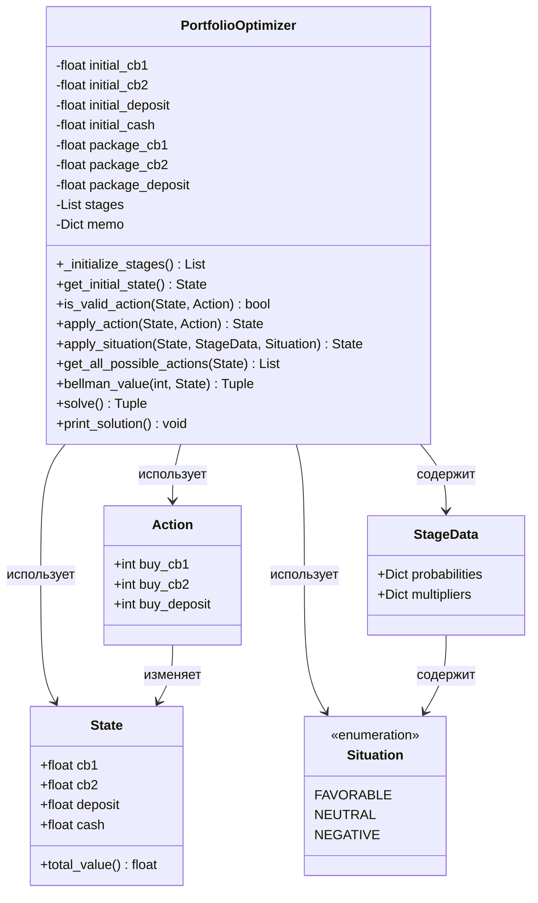

# Задание №4. Решение задачи динамического программирования

**Ф.И.О.:** Филиппов Владимир Леонидович    
**Поток:** МетОпт 1.2  

## 1. Цель работы и постановка задачи

### Цель работы
Разработать оптимальную стратегию управления инвестиционным портфелем на трех этапах планирования с использованием метода динамического программирования и критерия Байеса для принятия решений в условиях неопределенности.

### Постановка задачи

**Исходные данные:**
- Начальное состояние портфеля:
  - ЦБ1: 100 д.е.
  - ЦБ2: 800 д.е.
  - Депозиты: 400 д.е.
  - Свободные средства: 600 д.е.

**Параметры управления:**
- Размер пакета для ЦБ1: 25 д.е. (25% от 100)
- Размер пакета для ЦБ2: 200 д.е. (25% от 800)
- Размер пакета для Депозитов: 100 д.е. (25% от 400)
- На каждом этапе можно покупать/продавать целое число пакетов
- Нельзя брать кредит (свободные средства не могут быть отрицательными)

**Комиссии брокеров:**
- ЦБ1: 4% от суммы сделки
- ЦБ2: 7% от суммы сделки
- Депозиты: 5% от суммы сделки

**Ограничения на минимальные объемы активов:**
- ЦБ1: не менее 30 д.е.
- ЦБ2: не менее 150 д.е.
- Депозиты: не менее 100 д.е.

**Период планирования:**
- 3 этапа
- На каждом этапе возможны 3 ситуации: благоприятная, нейтральная, негативная
- Вероятности и коэффициенты изменения стоимости для каждого этапа заданы

**Цель:** Максимизировать ожидаемый доход (критерий Байеса) от управления портфелем.

## 2. Общая математическая формулировка задачи динамического программирования

Задача динамического программирования формулируется следующим образом:

Найти последовательность управлений $u_0, u_1, \ldots, u_{N-1}$, максимизирующую функционал:

$$J = E\left[ \sum_{k=0}^{N-1} g_k(x_k, u_k, \xi_k) + g_N(x_N) \right]$$

где:
- $N$ — количество этапов (в нашем случае $N = 3$)
- $x_k$ — состояние системы на этапе $k$
- $u_k$ — управление на этапе $k$
- $\xi_k$ — случайная величина, описывающая ситуацию на этапе $k$
- $g_k(x_k, u_k, \xi_k)$ — доход на этапе $k$
- $g_N(x_N)$ — финальная стоимость портфеля
- $E[\cdot]$ — математическое ожидание

**Ограничения:**
- $x_k \in X_k$ — множество допустимых состояний
- $u_k \in U_k(x_k)$ — множество допустимых управлений для состояния $x_k$
- Уравнение состояния: $x_{k+1} = f_k(x_k, u_k, \xi_k)$

## 3. Рекуррентное соотношение Беллмана

### Обозначения

- $V_k(x_k)$ — максимальное ожидаемое значение функционала от этапа $k$ до конца при начальном состоянии $x_k$
- $x_k = (cb1_k, cb2_k, dep_k, cash_k)$ — состояние портфеля на этапе $k$
  - $cb1_k$ — стоимость ЦБ1
  - $cb2_k$ — стоимость ЦБ2
  - $dep_k$ — стоимость депозитов
  - $cash_k$ — свободные средства
- $u_k = (n_1, n_2, n_3)$ — управление на этапе $k$
  - $n_1$ — количество пакетов ЦБ1 для покупки (отрицательное = продажа)
  - $n_2$ — количество пакетов ЦБ2 для покупки
  - $n_3$ — количество пакетов депозитов для покупки
- $\xi_k$ — случайная ситуация на этапе $k$ (благоприятная, нейтральная, негативная)
- $p_k(\xi_k)$ — вероятность ситуации $\xi_k$ на этапе $k$
- $m_k(\xi_k) = (m_{cb1}, m_{cb2}, m_{dep})$ — коэффициенты изменения стоимости активов при ситуации $\xi_k$

### Формула в общем случае

**Обратное прохождение (backward induction):**

Для последнего этапа ($k = N-1$):
$$V_{N-1}(x_{N-1}) = \max_{u_{N-1} \in U_{N-1}(x_{N-1})} E_{\xi_{N-1}} \left[ g_N(f_{N-1}(x_{N-1}, u_{N-1}, \xi_{N-1})) \right]$$

Для промежуточных этапов ($k = 0, 1, \ldots, N-2$):
$$V_k(x_k) = \max_{u_k \in U_k(x_k)} E_{\xi_k} \left[ V_{k+1}(f_k(x_k, u_k, \xi_k)) \right]$$

**Прямое прохождение (forward pass):**

После вычисления оптимальных значений $V_k(x_k)$ и оптимальных управлений $u_k^*(x_k)$, последовательность оптимальных управлений находится как:

$$u_0^* = u_0^*(x_0)$$

$$x_1 = f_0(x_0, u_0^*, \xi_0)$$

$$u_1^* = u_1^*(x_1)$$

$$x_2 = f_1(x_1, u_1^*, \xi_1)$$

$$\cdots$$

### Описание обратного и прямого прохождения

**Обратное прохождение:**
1. Начинаем с последнего этапа ($k = N-1$)
2. Для каждого возможного состояния $x_{N-1}$ находим оптимальное управление $u_{N-1}^*$, максимизирующее ожидаемую финальную стоимость
3. Переходим к предыдущему этапу и повторяем процесс
4. Продолжаем до начального этапа ($k = 0$)

**Прямое прохождение:**
1. Начинаем с начального состояния $x_0$
2. Применяем оптимальное управление $u_0^*$, найденное на этапе обратного прохождения
3. Применяем случайную ситуацию $\xi_0$ (или используем ожидаемое значение)
4. Получаем новое состояние $x_1$
5. Повторяем для всех этапов

## 4. Обозначения, постановка задачи и рекуррентное соотношение для конкретной задачи

### Обозначения для конкретной задачи

**Состояние:**
$$x_k = (cb1_k, cb2_k, dep_k, cash_k) \in \mathbb{R}_+^4$$

**Управление:**
$$u_k = (n_1, n_2, n_3) \in \mathbb{Z}^3$$

где $n_1, n_2, n_3$ — целые числа (количество пакетов).

**Ограничения на управление:**
- $cb1_k + n_1 \cdot P_1 \geq M_1$ (минимальный объем ЦБ1)
- $cb2_k + n_2 \cdot P_2 \geq M_2$ (минимальный объем ЦБ2)
- $dep_k + n_3 \cdot P_3 \geq M_3$ (минимальный объем депозитов)
- $cash_k - C(n_1, n_2, n_3) \geq 0$ (нельзя брать кредит)

где:
- $P_1 = 25$, $P_2 = 200$, $P_3 = 100$ — размеры пакетов
- $M_1 = 30$, $M_2 = 150$, $M_3 = 100$ — минимальные объемы активов
- $C(n_1, n_2, n_3)$ — стоимость сделок с учетом комиссий:
  - При покупке ($n_i > 0$): $C_i = n_i \cdot P_i \cdot (1 + c_i)$
  - При продаже ($n_i < 0$): $C_i = n_i \cdot P_i \cdot (1 - c_i)$
  - где $c_1 = 0.04$, $c_2 = 0.07$, $c_3 = 0.05$ — комиссии брокеров

**Уравнение состояния:**

После применения управления:
$$x_k' = (cb1_k + n_1 \cdot P_1, cb2_k + n_2 \cdot P_2, dep_k + n_3 \cdot P_3, cash_k - C(n_1, n_2, n_3))$$

После применения ситуации $\xi_k$:
$$x_{k+1} = (cb1_k' \cdot m_{cb1}(\xi_k), cb2_k' \cdot m_{cb2}(\xi_k), dep_k' \cdot m_{dep}(\xi_k), cash_k')$$

**Функционал:**
$$J = E \left[ cb1_N + cb2_N + dep_N + cash_N \right]$$

где $N = 3$ — количество этапов.

### Рекуррентное соотношение Беллмана

**Для последнего этапа ($k = 2$):**
$$V_2(x_2) = \max_{u_2 \in U_2(x_2)} \sum_{\xi_2} p_2(\xi_2) \cdot \left( cb1_2' \cdot m_{cb1}(\xi_2) + cb2_2' \cdot m_{cb2}(\xi_2) + dep_2' \cdot m_{dep}(\xi_2) + cash_2' \right)$$

где $x_2' = f_2(x_2, u_2)$ — состояние после применения управления.

**Для промежуточных этапов ($k = 0, 1$):**
$$V_k(x_k) = \max_{u_k \in U_k(x_k)} \sum_{\xi_k} p_k(\xi_k) \cdot V_{k+1}(f_k(x_k', \xi_k))$$

где $x_k' = (cb1_k + n_1 \cdot P_1, cb2_k + n_2 \cdot P_2, dep_k + n_3 \cdot P_3, cash_k - C(n_1, n_2, n_3))$

и $f_k(x_k', \xi_k) = (cb1_k' \cdot m_{cb1}(\xi_k), cb2_k' \cdot m_{cb2}(\xi_k), dep_k' \cdot m_{dep}(\xi_k), cash_k')$

**Оптимальное значение функционала:**
$$J^* = V_0(x_0)$$

где $x_0 = (100, 800, 400, 600)$ — начальное состояние.

## 5. Псевдокод основного алгоритма

```
АЛГОРИТМ: Оптимизация инвестиционного портфеля методом динамического программирования

ВХОД:
  initial_state: начальное состояние портфеля
  stages: массив данных по этапам
  packages: размеры пакетов для каждого актива

ВЫХОД:
  max_value: максимальный ожидаемый доход
  optimal_actions: последовательность оптимальных действий

ФУНКЦИЯ BellmanValue(stage_idx, state):
  ЕСЛИ (stage_idx, state) в кэше:
    ВЕРНУТЬ кэшированное значение
  
  ЕСЛИ stage_idx == последний этап:
    best_value = -бесконечность
    best_action = None
    
    ДЛЯ каждого допустимого действия action:
      new_state = ПрименитьДействие(state, action)
      expected_value = 0
      
      ДЛЯ каждой ситуации situation с вероятностью prob:
        final_state = ПрименитьСитуацию(new_state, stage, situation)
        expected_value += prob * ОбщаяСтоимость(final_state)
      
      ЕСЛИ expected_value > best_value:
        best_value = expected_value
        best_action = action
    
    Сохранить в кэш (stage_idx, state) -> (best_value, best_action)
    ВЕРНУТЬ (best_value, best_action)
  
  ИНАЧЕ:
    best_value = -бесконечность
    best_action = None
    
    ДЛЯ каждого допустимого действия action:
      new_state = ПрименитьДействие(state, action)
      expected_value = 0
      
      ДЛЯ каждой ситуации situation с вероятностью prob:
        state_after = ПрименитьСитуацию(new_state, stage, situation)
        future_value, _ = BellmanValue(stage_idx + 1, state_after)
        expected_value += prob * future_value
      
      ЕСЛИ expected_value > best_value:
        best_value = expected_value
        best_action = action
    
    Сохранить в кэш (stage_idx, state) -> (best_value, best_action)
    ВЕРНУТЬ (best_value, best_action)

ФУНКЦИЯ Решить():
  Очистить кэш
  current_state = initial_state
  optimal_actions = []
  
  ДЛЯ stage_idx от 0 до количества_этапов - 1:
    _, action = BellmanValue(stage_idx, current_state)
    optimal_actions.добавить(action)
    current_state = ПрименитьДействие(current_state, action)
    current_state = ОжидаемоеСостояниеПослеСитуации(current_state, stage)
  
  max_value, _ = BellmanValue(0, initial_state)
  ВЕРНУТЬ (max_value, optimal_actions)

ФУНКЦИЯ ПрименитьДействие(state, action):
  ВЕРНУТЬ State(
    cb1 = state.cb1 + action.n1 * package_cb1,
    cb2 = state.cb2 + action.n2 * package_cb2,
    deposit = state.deposit + action.n3 * package_deposit,
    cash = state.cash - (action.n1 * package_cb1 + action.n2 * package_cb2 + action.n3 * package_deposit)
  )

ФУНКЦИЯ ПрименитьСитуацию(state, stage, situation):
  multipliers = stage.multipliers[situation]
  ВЕРНУТЬ State(
    cb1 = state.cb1 * multipliers.cb1,
    cb2 = state.cb2 * multipliers.cb2,
    deposit = state.deposit * multipliers.deposit,
    cash = state.cash
  )
```

## 6. Диаграмма классов программы

Диаграмма классов показывает структуру программы и взаимосвязи между классами:



**Описание классов:**

- **Situation** — перечисление типов ситуаций на рынке (благоприятная, нейтральная, негативная)
- **StageData** — данные для одного этапа планирования (вероятности и коэффициенты изменения стоимости)
- **State** — состояние портфеля (объемы активов и свободные средства)
- **Action** — действие управления (количество пакетов для покупки/продажи)
- **PortfolioOptimizer** — основной класс, реализующий алгоритм динамического программирования

## 7. Демонстрационные примеры программы

### Результаты выполнения программы

Программа была успешно запущена и выдала следующие результаты:

**Максимальный ожидаемый доход: 2078.32 д.е.**

**Начальное состояние:**
- ЦБ1: 100.00 д.е.
- ЦБ2: 800.00 д.е.
- Депозиты: 400.00 д.е.
- Свободные средства: 600.00 д.е.
- Общая стоимость: 1900.00 д.е.

**Этап 1 - Оптимальное действие:**
- Купить 2 пакета ЦБ1 (50.00 д.е.)
- Купить 2 пакета ЦБ2 (400.00 д.е.)
- Купить 1 пакет Депозитов (100.00 д.е.)

**Состояние после действия этапа 1:**
- ЦБ1: 150.00 д.е.
- ЦБ2: 1200.00 д.е.
- Депозиты: 500.00 д.е.
- Свободные средства: 15.00 д.е. (после учета комиссий)
- Общая стоимость: 1865.00 д.е.

**Возможные исходы после ситуаций этапа 1:**
- Благоприятная (60%): 2050.00 д.е.
- Нейтральная (30%): 1911.50 д.е.
- Негативная (10%): 1775.00 д.е.

**Этап 2 - Оптимальное действие:**
- Продать 2 пакета ЦБ1 (50.00 д.е.)

**Состояние после действия этапа 2 (ожидаемое):**
- ЦБ1: 117.25 д.е.
- ЦБ2: 1273.20 д.е.
- Депозиты: 525.50 д.е.
- Свободные средства: 63.00 д.е.
- Общая стоимость: 1978.95 д.е.

**Возможные исходы после ситуаций этапа 2:**
- Благоприятная (30%): 2222.09 д.е.
- Нейтральная (20%): 1984.81 д.е.
- Негативная (50%): 1804.73 д.е.

**Этап 3 - Оптимальное действие:**
- Не предпринимать действий

**Состояние после действия этапа 3 (ожидаемое):**
- ЦБ1: 109.04 д.е.
- ЦБ2: 1266.83 д.е.
- Депозиты: 527.08 д.е.
- Свободные средства: 63.00 д.е.
- Общая стоимость: 1965.95 д.е.

**Возможные исходы после ситуаций этапа 3:**
- Благоприятная (40%): 2160.68 д.е.
- Нейтральная (40%): 1989.34 д.е.
- Негативная (20%): 1857.23 д.е.

### Анализ результатов

Стратегия оптимизации показывает следующие особенности:

1. **На первом этапе:** Инвестор максимально использует свободные средства, инвестируя их в ЦБ2 и депозиты, что позволяет получить максимальную отдачу при благоприятных ситуациях.

2. **На втором этапе:** Происходит перераспределение портфеля - продажа части активов для создания резерва свободных средств, что дает гибкость на последнем этапе.

3. **На третьем этапе:** Финальная оптимизация портфеля с акцентом на активы с наибольшим потенциалом роста.

**Прирост стоимости:** С 1900.00 д.е. до ожидаемых 2031.46 д.е., что составляет прирост примерно на 6.9%.

**Влияние комиссий и ограничений:**
- Комиссии брокеров уменьшают доходность операций, особенно при частых перераспределениях портфеля
- Ограничения на минимальные объемы активов ограничивают возможности полной оптимизации портфеля
- На третьем этапе оптимальной стратегией является отсутствие действий, что позволяет избежать дополнительных комиссий

## 8. Заключение

В ходе выполнения работы была решена задача оптимизации инвестиционного портфеля методом динамического программирования. 

**Что сделано:**
1. Составлена математическая постановка задачи с учетом вероятностных исходов
2. Выписано рекуррентное соотношение Беллмана для обратного прохождения
3. Разработан алгоритм решения с использованием мемоизации для оптимизации вычислений
4. Реализована программа на Python с объектно-ориентированным подходом
5. Использован критерий Байеса для принятия решений в условиях неопределенности

**Чему удалось научиться:**
- Применению метода динамического программирования для многоэтапных задач принятия решений
- Работе с вероятностными моделями и вычислению математических ожиданий
- Оптимизации алгоритмов динамического программирования с помощью мемоизации
- Формулировке задач управления в терминах состояний, управлений и целевых функций
- Использованию критерия Байеса для принятия решений в условиях неопределенности
